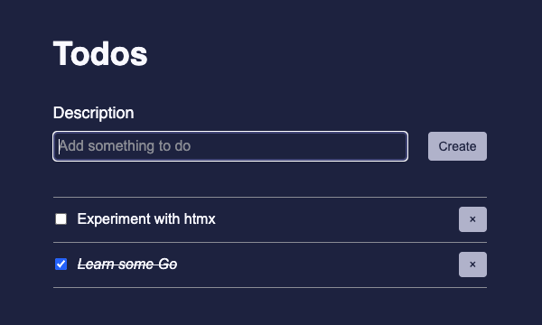

# TODO Go

A small TODO app for practicing Go.



Feel free to follow along while I make progress. There will be plenty of
mistakes.

Goals:
- Practice writing a real-world app with Go
- Practice using HTMX

## Running the App

You can run the app in a few different ways:
- Go CLI
- Docker
- [Air – Live reload for Go apps](https://github.com/cosmtrek/air)

The quickest way to get the app up and running is to run it with Go and the
`-localdb` flag.

```sh
go run cmd/web/main.go -localdb
```

Read more about all the different ways to run the app below.

### Database

By default, the app will try to connect to a Postgres database. The app can also
be run with an in-memory database which is useful when developing locally and
testing.

### Flags

`-localdb`: This flag will tell the app to use a local, in-memory database
instead of Postgres.

### Environment Variables

| Variable | Default Value | Usage |
|----------|-------|---------------|
| `TODO_DB_NAME` | `todo` | Postgres database name |
| `TODO_DB_PORT` | `5432` | Postgres database port |
| `TODO_DB_USER` | `todouser` | Postgres database user |
| `TODO_DB_PW` | `todopassword` | Postgres database password |
| `TODO_WEB_PORT` | `8080` | Web app port |

### Running with Go

The most direct way to run the app is with Go; however, if you plan on using a
Postgres database, you’ll need to make sure you have one up and running.

```sh
go run cmd/web/main.go
```

With the in-memory database:

```sh
go run cmd/web/main.go -localdb
```

On a different port:

```sh
TODO_WEB_PORT=8001 go run cmd/web/main.go
```

### Running with Docker

To avoid the hassle of setting up and running Postgres locally you can use
Docker.

#### Docker Compose

```sh
docker-compose up
```

With the in-memory database:

```sh
TODO_ARGS=-localdb docker-compose up
```

#### Environment Variables

To use environment variables with Docker Compose create a `.env` file in the
project root.

Example `.env` file:

```sh
TODO_DB_NAME=cooltododb
TODO_DB_PORT=5433
TODO_DB_USER=raduser
TODO_DB_PW=supersecurepassword
TODO_WEB_PORT=8001
```

#### Build Cache

Docker Compose will cache the Docker build of the app image specified in the
Dockerfile. If you make some file changes, rebuild with Docker Compose to see
the changes in action.

```sh
docker-compose build --no-cache
```

### Running with Air

Local development can be a lot easier if the server restarts when files are
changed. This is what Air does; it’s Live reload for Go apps.

Install Air:

```sh
go install github.com/cosmtrek/air@latest
```

Run the app with Air:

```sh
air
```

With the in-memory database:

```sh
air -- -localdb
```
